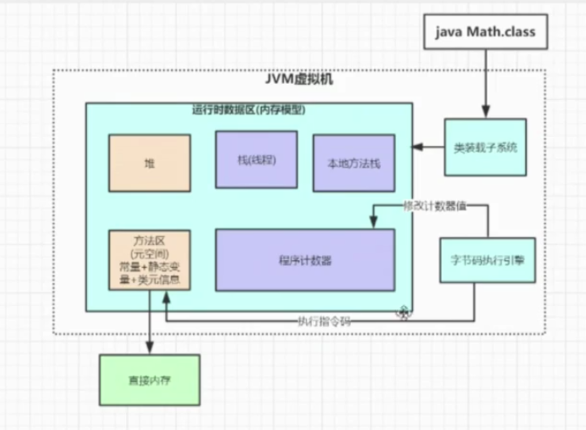
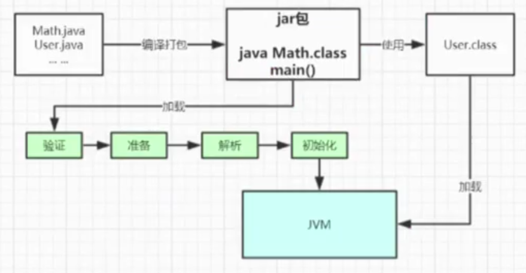
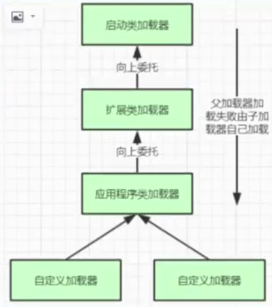
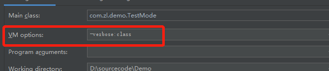

# 类加载机制

## 一： 类加载过程
- 1、多个Java文件经过编译打包成可运行的jar包，最终有Java命令运行某个主类的main函数启动程序，这里首先需要通过Java类加载器把主类加载到JVM
- 2、主类在加载过程中如果使用到了其他的类，会逐步加载这些类；
**注意：jar包并不是一次性全部加载的，是用到才加载；**

> 类加载整个过程有如下：
+ 加载  通过IO读取字节码文件，使用到类时才会加载
+ 验证   校验字节码文件
+ 准备   给类的静态变量分配内存，并赋予默认值
+ 解析   将符号引用替换成直接引用，该阶段会把一些静态方法(符号引用,比如main()方法)替换为指向数据所存储的内存的指针或者句柄等（直接引用），这是所谓的静态链接过程（类加载期间完成），动态链接是在程序运行期间完成的将符号引用替换为直接引用；
+ 初始化  对类的静态变量初始化为指定的值，执行静态代码块；



## 二： 类加载器和双亲委派机制
上面的类加载过程主要是通过类加载器来实现的，Java里面有如下几种加载器
+ 启动类加载器： 负责加载支撑JVM运行的位于JRE的lib目录下的核心类库，比如rt.jar，charsets.jar等
+ 扩展类加载器：负责加载支撑JVM运行的位于JRE的lib目录下的ext扩展目录下的JAR包
+ 应程序类加载器： 负责加载classPath路径下的类包，主要就是加载自己写的那些类
+ 自定义加载器：负责加载用户自定义路径下的类包

看一个类加载示例：
```java
public class ClassLoadTest {
    public static void main(String[] args) {
        System.out.println(String.class.getClassLoader());
        System.out.println(DESKeyFactory.class.getClassLoader().getClass().getName());
        System.out.println(ClassLoadTest.class.getClassLoader().getClass().getName());
        System.out.println(ClassLoader.getSystemClassLoader().getClass().getName());
    }
}
```
输出
```
null
sun.misc.Launcher$ExtClassLoader       扩展类加载器
sun.misc.Launcher$AppClassLoader       应用程序加载器 
sun.misc.Launcher$AppClassLoader
```

> 疑问：为什么String的类加载器为null

* 因为Java的启动类加载器是基于c语言实现，那么将找不到Java的实现类，所以打印null值；
---
> 自定义一个类加载器

**自定义类加载器只需要继承java.lang.ClassLoader类，该类有两个核心方法，一个是loadClass(String, boolean)，实现了双亲委派机制，大体逻辑如下：**
+ 首先检查一下指定名称的类是否已经加载过了，如果加载过了，就不如要在次加载，直接返回；
+ 如果此类没有加载过，那么在判断一下是否有父类加载器；如果有父类加载器，则由父类加载器（调用parent.loadClass(name, false)）,或者是调用bootstrap类加载器来加载；
+ 如果父类加载器以及bootstrap类加载器都没有找到指定的类，那么调用当前类加载器的findClass方法来完成类的加载。
+ 还有一个方法是findClass，默认实现是抛出异常，所以我们自定义类加载器主要是重写findClass方法；

```java
public class MyClassLoadTest {
    static class MyClassLoader extends ClassLoader {
        private String classPath;


        public MyClassLoader(String classPath) {
            this.classPath = classPath;
        }


        private byte[] loadBytes(String name) throws  Exception {
            name = name.replace("\\.", "/");
            FileInputStream fis = new FileInputStream(classPath + "/" + name + ".class");
            int len = fis.available();
            byte[] data = new byte[len];
            fis.read(data);
            fis.close();
            return data;
        }


        @Override
        protected Class<?> findClass(String name) throws ClassNotFoundException {
            try {
                byte[] data = loadBytes(name);
                // defineClass将一个字节数组转为class对象，这个字节数组是class文件读取后的最终字节数组
                return defineClass(name, data, 0, data.length);
            } catch (Exception e) {
                e.printStackTrace();
                throw new ClassNotFoundException();
            }
        }
    }


    public static void main(String[] args) throws Exception {
        MyClassLoader classLoader = new MyClassLoader("D:/sourcecode/Demo");
        Class clazz = classLoader.loadClass("com.zl.demo.classLoadT.ClassLoadTest");
        Object obj = clazz.newInstance();
        Method method =  clazz.getDeclaredMethod("sout", null);
        method.invoke(obj, null);
        System.out.println(clazz.getClassLoader().getClass().getName());
    }
}
```
> 问题： 此处类的加载器是AppClassLoader加载，因为这里调用的是loadClass方法，但是loadClass方法会使用双亲委派机制，会委派父加载器加载；所以此处定义ClassLoadTest为非classaPat路径下即可；

双亲委派机制（JVM类加载器是有双亲自层级结构的，如下图）

---




**双亲委派机制简单点说：先找父亲加载，不行在由儿子自己加载；**

> 为什么要设计双亲委派机制？
* 沙箱安全机制：自己写的Java.lang.String.class类不会被加载，这样便可以防止核心API库不被随意篡改；
* 避免类的重复加载：当父亲已经加载了该类时，就没有必要子ClassLoad在加载一次，

示例：自定义一个java.lang包，并定义String类
```java
package java.lang;

public class String {
    public static void main(String[] args) {
        System.out.println("hello!");
    }
}
```
运行结果如下：
```
错误: 在类 java.lang.String 中找不到 main 方法, 请将 main 方法定义为:
   public static void main(String[] args)
否则 JavaFX 应用程序类必须扩展javafx.application.Application
```
---

**结论同上，当加载自定义的String类的时候会逐级判断父加载器是否已加载，最终判断已经在启动类加载器中加载，则返回jre下的String类；**

> 打破双亲委派 （以Tomcat类加载为例，Tomcat如果使用默认的双亲委派类加载机制行不行？）
* Tomcat作为一个web容器，那么它需要解决什么问题：
* 部署在同一个web 容器的相同的类库相同版本可以共享。否则，如果服务器有10个应用程序，那么要有10分相同的类库加载进虚拟机。
* web容器也有自己依赖的类库，不能与应用程序的类库混淆。基于安全考虑，应该让容器的类库和程序的类库隔离开来。
* web容器要支持jsp的修改，我们知道，jsp文件最终也是要编译成class文件才能在虚拟机中运行，但是程序运行后修改jsp文件是司空见惯，web容器需要支持jsp修改后不用重启服务。
* 一个web容器可能需要部署两个以上的应用程序，不同的应用程序可能会依赖同一个第三方类库的不同版本，不能要求同一个类库在同一个服务器中只有一份，因此要保证每个应用程序的类库都是独立的，保证相互隔离；

> 在看看我们的问题Tomcat如果使用默认的双亲委派加载机制行不行？
```
答案是不行的，为什么？
第一个问题：如果使用默认的类加载机制，那么是无法加载两个相同类库的不同版本，默认的类加载器是不管你是什么版本，只在乎你的全局定义类名，并且只有一份；
第二个问题： 默认的类加载器是能够实现的，因为他的职责就是保证唯一性；
第三个问题和第一个问题一样；
第四个问题：我们要怎么实现jsp文件的热加载，jsp文件其实也就是class文件，如果修改了，但是类名还是一样，类加载器就会直接取方法去中已经存在的，修改后的jsp是不会重新加载的，那么我们可以直接卸载掉这jsp文件的类加载器，
所以应该可以想到，每个jsp文件对应一个唯一的类加载器，当某个jsp文件修改了，就直接卸载这个jsp类加载器，重新创建类加载器，重新加载jsp文件。

```
如果想打破双亲委派机制，则只需要自己定义类加载器，并复写loadClass方法，不使用双亲委派机制即可；

查看哪些类被加载，在启动的时候加启动参数：-verbose:class


