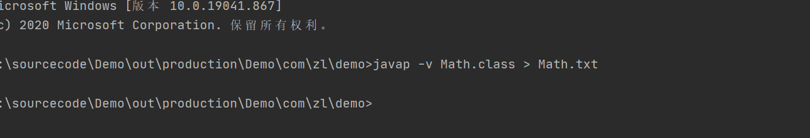
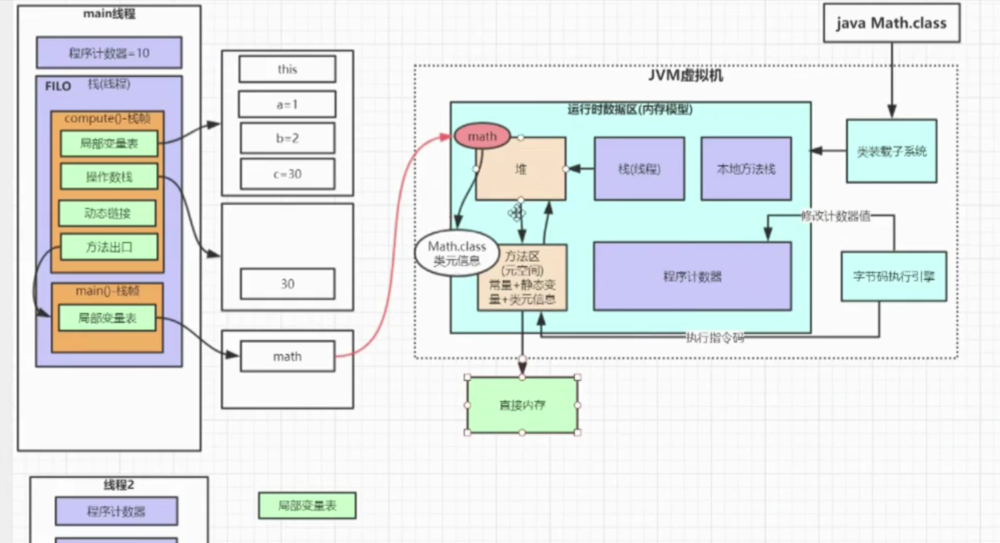
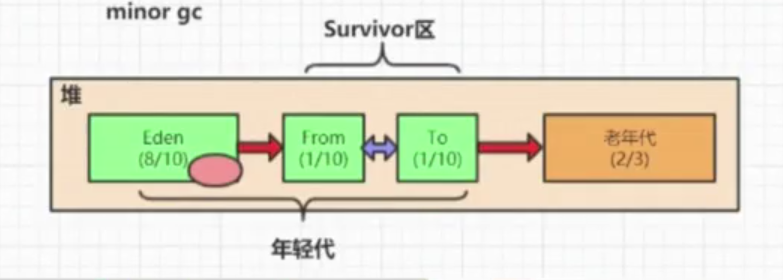
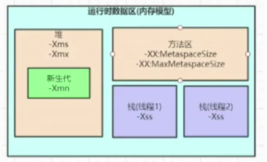
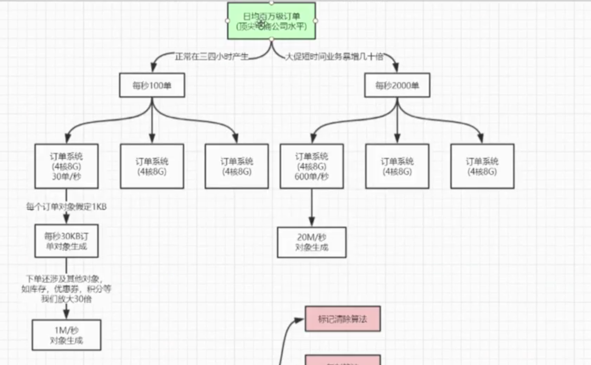
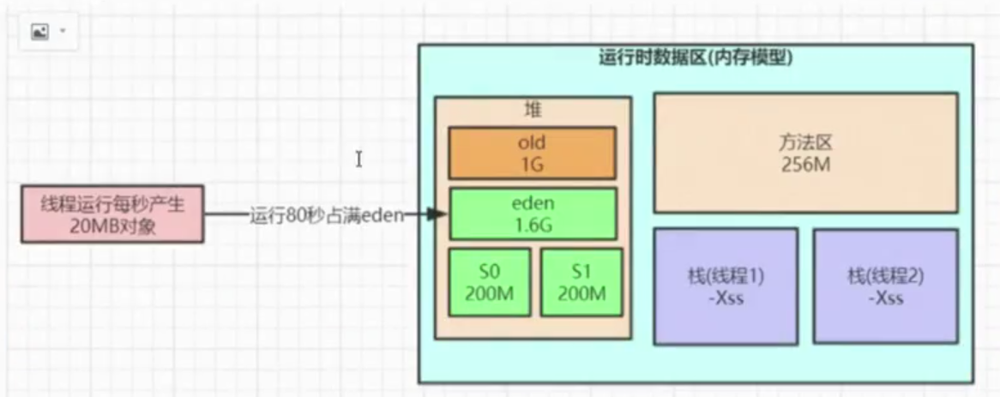
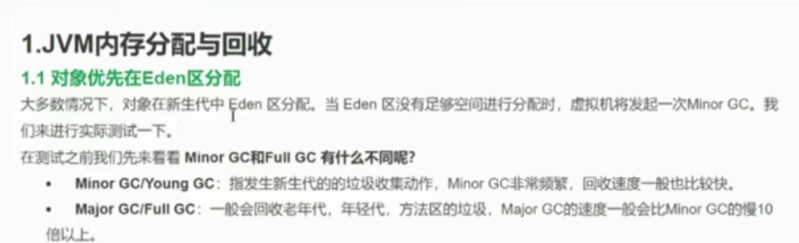

# Java内存模型深度剖析
## Java内存模型
+ 堆：
+ 栈：
+ 本地方法栈：
+ 方法区（元空间） 常量 + 静态变量 + 类元信息：
+ 程序计数器：

执行命令javap -v Math.class > Math.txt   查看Math.txt的常量池等信息

运行时内存区域：

JAVA内存参数大小该如何设置？
JVM参数大小设置并没有固定的标准，而是需要根据实际项目情况分析，举例说明：

**Java调优的目的，减少full GC的次数**

假设业务量暴增几十倍,在不增加机器的前提下,整个系统每秒要生成几千个订单,之前每秒往新生代里分配的1M对象数据可能增长到几十M,而且因为系统压力骤增,一个订单的生成不一定能在1秒内完成,可能要几秒甚至几十秒,那么就有很多对象会在新生代里存活几十秒之后才会变为垃圾对象,如果新生代只分配了几百M,意味着一二十秒就会触发一次 minor gc,那么很有可能部分对象就会被挪到老年代,这些对象到了老年代后因为对应的业务操作执行完毕,马上又变为了垃圾对象,随着系统不断运行,被挪到老年代的对象会越来越多,最终可能又会导致 full gc, full gc对系统的性能影响还是比较大的。

如果我们用的是4核8G的服务器,新生代分配到2G以上的水平,那么至少也要几百秒才会放满新生代触发 minor gc,那些在新生代即便存活几十秒的对象在 minor gc触发的时候大部分已经变为垃圾对象了,都可以被及时回收,基本不会被挪到老年代,这样可以大大减少老年代的 full gc次数；

## 逃逸分析
> JVM的运行模式有三种:
* 解释模式(Interpreted Mode):只使用解释器(-xint强制JVM使用解释模式),执行一行JVM字节码就编译一行为机器码
* 编译模式(Compiled Mode):只使用编译器(--Xcomp JVM使用编译模式),先将所有M字节码一次编译为机器码,然后一次性执行所有机器码
* 混合模式(Mixed Mode):依然使用解释模式执行代码,但是对于一些热点代码采用编译模式执行,JVM一般采用混合模式执行代码
* 解释模式启动快,对于只需要执行部分代码,并且大多数代码只会执行一次的情况比较适合，编译模式启动慢,但是后期执行速度快而且比较占用内存,因为机器码的数量至少是JVM字节码的十倍以上,这种模式适合代码可能会被反复执行的场景;混合模式是JVM默认采用的执行代码方式,一开始还是解释执行,但是对于少部分“热点代码会采用编译模式执行,这些热点代码对应的机器码会被缓存起来,下次再执行无需再编译,这就是我们常见的JT(Just InTime Compiler)即时编译技术，在即时编译过程中JVM可能会对我们的代码做一些优化,比如对象逃逸分析等。

对象逃逸分析:就是分析对象动态作用域,当一个对象在方法中被定义后,它可能被外部方法所引用,例如作为调用参数传递到其他地方中；

JDK1.7之后默认开启逃逸分析，如果要关闭参数（-XX: -DoEscapeAnalysis）,让JVM进行逃逸分析，分析对象的作用域，进行对象回收，是在即时编译中发生；（Just InTime）

### 1.JVM内存分配与回收
1.1对象优先在Eden区分配
大多数情况下,对象在新生代中Eden区分配当Eden区没有足够空间进行分配时,虚拟机将发起一次 Minor GC，我们来进行实际测试一下
在测试之前我们先来看看 Minor GC和Full GC有什么不同呢?
* Minor GC/Young GC:指发生新生代的的垃圾收集动作, Minor GC非常频繁,回收速度一般也比较快
* Major GC/fuG:一般会回收老年代年轻代,方法区的垃圾, Major GCMi的速度一般会比 GC的慢10倍以上
