# jvm垃圾回收算法

## 对象生命周期
> 思考：所谓的内存调优即是利用Java自带的参数来选择垃圾回收算法以及垃圾回收器，从而减少GC（重点是Full GC）的次数以及时间；
* 1.VM内存分配与回收
* 1.1对象优先在Eden区分配

**大多数情况下,对象在新生代中Eden区分配.当Eden区没有足够空间进行分配时,虚拟机将发起一次 Minor GC.**

我们来进行实际测试一下,在测试之前我们先来看看 Minor GC和Full GC有什么不同呢?

* Minor GCYoung GC:指发生新生代的的垃圾收集动作, Minor GC非常频繁,回收速度一般也比较快。
* Minor GC/Full GC:一般会回收老年代和年轻代方法区的垃圾, Full GC的速度一般会比Minor GC的慢10倍以上

示例：
加启动参数：-XX:+PrintGCDetails
```java

public class GcTest {
    public static void main(String[] args) throws InterruptedException{
        byte[] allocation1,allocation2;
        allocation1 = new byte[60000 * 1024];
        allocation2 = new byte[8000 * 1024];
    }
}
```
输出结果：
```
[GC (Allocation Failure) [PSYoungGen: 65024K->776K(75776K)] 65024K->784K(249344K), 0.0108043 secs] [Times: user=0.00 sys=0.00, real=0.01 secs]
Heap
PSYoungGen      total 75776K, used 2076K [0x000000076b900000, 0x0000000770d80000, 0x00000007c0000000)
  eden space 65024K, 2% used [0x000000076b900000,0x000000076ba45378,0x000000076f880000)
  from space 10752K, 7% used [0x000000076f880000,0x000000076f942020,0x0000000770300000)
  to   space 10752K, 0% used [0x0000000770300000,0x0000000770300000,0x0000000770d80000)
ParOldGen       total 173568K, used 8K [0x00000006c2a00000, 0x00000006cd380000, 0x000000076b900000)
  object space 173568K, 0% used [0x00000006c2a00000,0x00000006c2a02000,0x00000006cd380000)
Metaspace       used 3300K, capacity 4496K, committed 4864K, reserved 1056768K
  class space    used 359K, capacity 388K, committed 512K, reserved 1048576K


Process finished with exit code 0
```
### 1.2大对象直接进入老年代
大对象就是需要大量连续内存空间的对象(比如:字符串数组).jM参数 -XX:PretenureSizeThreshold可以设置大对象的大小,如果对象超过设置大小会直接进入老年代,不会进入年轻代,这个参数只在 Serial和 ParNew两个收集器下有效.
比如设置jVM参数:-XXPretenureSizeThreshold=100000 -XX:+UseSerialGC,再执行下上面的第一个程序会发现
大对象直接进了老年代
为什么要这样呢?
为了避免为大对象分配内存时的复制操作而降低效率

### 1.3长期存活的对象将进入老年代
既然虚拟机采用了分代收集的思想来管理内存,那么内存回收时就必须能识别哪些对象应放在新生代,哪些对象应放在老年代中,为了做到这一点,虚拟机给每个对象一个对象年龄(Age)计数器.
如果对象在Eden出生并经过第一次 Minor GC后仍然能够存活,并且能被 Survivor容纳的话,将被移动到Survivor空间中,并将对象年龄设为1.对象在 Survivor中每熬过一次 MinorGC,年龄就增加1岁,当它的年龄增加到一定程度默认为15岁，就会晋升到老年代中，对象晋升到老年代的年龄阈值，可以通过参数 -XX:MaxTenuringThreshold来设置。

### 1.4 对象动态年龄判断
当前放对象的 Survivor区域里(其中一块区域,放对象的那块s区),一批对象的总大小大于这块 Survivor区域内存大小的50%,那么此时大于等于这批对象年龄最大值的对象,就可以直接进入老年代了,例如 Survivor区域里现在有一批对象,年龄1+年龄2+年龄n的多个年龄对象总和超过了区域的50%,此时就把年龄n以上的对象都放入老年代这个规则其实是希望那些可能是长期存活的对象,尽早进入老年代。对象动态年龄判断机制一般是在 minor gc之后触发的。

### 1.5 Minor gc 后存活的对象Survivor区放不下
这种情况会把存活的对象部分挪到老年代,部分可能还会放在 Survivor区

### 1.6老年代空间分配担保机制
年轻代每次 minor gc之前JVM都会计算下老年代剩余可用空间，
如果这个可用空间小于年轻代里现有的所有对象大小之和(包括垃圾对象）
就会看一个"-XX:-HandlePromotionFailure" (jdk1.8默认就设置了)的参数是否设置了，
如果有这个参数,就会看看老年代的可用内存大小,是否大于之前每一次 minor gc后进入老年代的对象的平均大小。如果是，执行Full GC，不然执行minor GC。
如果上一步结果是小于或者之前说的参数没有设置,那么就会触发一次Full gc,对老年代和年轻代一起回收一次垃圾,如果回收完还是没有足够空间存放新的对象就会发生"OOM"

当然,如果 minor gc之后剩余存活的需要挪动到老年代的对象大小还是大于老年代可用空间,那么也会触发 full gc,full gc完之后如果还是没可用空间放minor gc之后的存活对象,则也会发生"OOM";
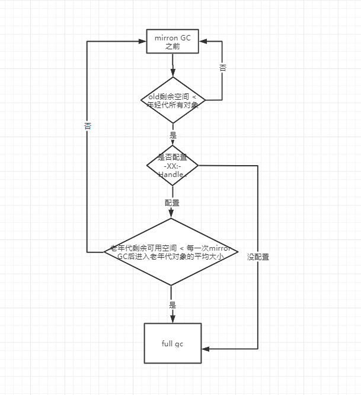

### 1.7 Eden与 Survivor区默认8:1:1
大量的对象被分配在eden区,eden区满了后会触发minor gc.可能会有99%以上的对象成为垃圾被回收掉,剩余存活的对象会被挪到为空的那块 survivor区,下一次eden区满了后又会触发minor gc,把eden区和survivor区垃圾对象回收,把剩余存活的对象一次性挪动到另外一块为空的 survivor区,因为新生代的对象都是朝生夕死的,存活时间很短,
所以JVM默认的8:1:1的比例是很合适的,让eden区尽量的大 survivor区够用即可。

JVM 默认这个参数 -XX:+UseAdaptiveSizePolicy会导致这个比例的变化，如果不想这个比例有变化可以设置参数：-XX:-UseAdaptiveSizePolicy

## 如何判断对象可被回收
堆中几乎存放着所有的对象实例，对堆垃圾回收前的第一步就是判断哪些对象已经死亡（即不能在被任何途径使用的对象）。

### 2.1 引用计数法
给对象添加一个引用计数器，每当有一个地方引用它，计数器就加1；当引用失效，计数器就减1；任何时候计数器为0的对象就是不能再被使用的。
这个方法实现简单，效率高，但是目前主流的虚拟机中并没有选择这个算法来管理内存，最重要原因是它很难解决对象之间的相互循环引用的问题。


### 2.2 可达性分析算法
这个算法基本思想就是通过一系列的称为“GC Roots”的对象作为七点，从这些节点开始向下搜索，找到的对象都是标记为非垃圾的对象，其余未标记的对象都是垃圾对象。
GC Roots根节点：线程栈本地变量、静态变量、本地方法栈的变量等等
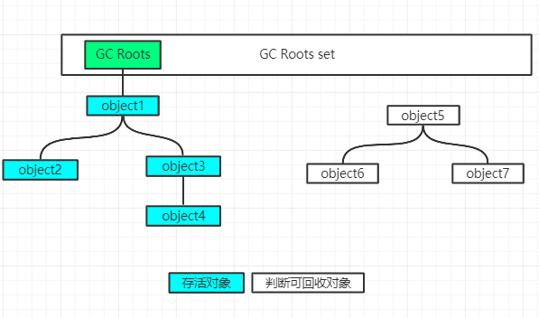

### 2.3 常见引用类型

java的引用类型一般分为四种：强引用、软引用、弱引用、虚引用

强引用： 普通的变量引用
```
public static User user = new User();
```
软引用： 将对象用SoftReference对象包裹起来，正常情况不会被回收，但是GC做完后发现释放不出空间存放新的对象，则会把这些软引用对象回收掉。软引用对象可用来实现内存敏感的高速缓存。
```
public static SoftReference<User> user = new SoftReference<User>(new User());

```
软引用在实际中有重要的引用，例如浏览器的后退按钮。按后退时候，这个后退的网页内容是重写进行新的请求还是从缓存中读取呢？这就看具体实现策略了。
如果一个网页在如果将浏览过的页面存储到内存中会造成内存的大量浪费，甚至会造成内存溢出
浏览器结束时就进行了内容的回收，则按照后退查看前面浏览的过的页面时，需要重新构建，。
弱引用： 将对应用WeakReference软引用类型对象包裹，弱引用跟没引用差不多，GC会直接回收掉，很少用

虚引用：虚引用叶称为幽灵引用或者幻影引用，它是一种最弱的引用关系，几乎不用

### 2.4 finalize()方法最终判定对象是否存活
即使在可达性分析算法中不可达对象，也并非是“非死不可”的,这时候他们暂时处于一种“死缓”的阶段，而真正宣告一个对象死亡，至少要经历再次标记的过程。
标记的前提是对象在进行可达性分析后发现没有与GC Roots相连接的引用链。
第一次标记并进行筛选
筛选条件是此对象是否有必要执行finalize()方法。
当对象没有覆盖finalize方法，对象将直接被回收。
第二次标记
如果这个对象覆盖了finalize方法，finalize方法是对象脱逃死亡命运的最后一次机会，如果对象要在finalize()中成功拯救自己，只要重新与引用链上的任何一个对象建立联系即可，譬如吧自己赋值给某个类变量或者对象的成员变量，那在第二次标记时它将移除“即将回收”的集合，如果对象这个时候还没有逃脱，那基本上他就真的被回收了。

### 2.5 如何判断一个类是无用的类
方法区主要回收的是无用的类，那么如何判断一个类是无用的类呢？
类如要同满足下面3个条件才能算是“无用的类”：
该类所有的实例都已经被回收了，也就是Java堆中不存在该类的实例；
加载该类的ClassLoader已经被回收
该类对应的java.lang.Class对象没有在任何地方被引用，无法在任何地方通过反射访问该类的方法；


## 垃圾回收算法
### 1.标记清除算法
    算法分为“标记”和“清除”阶段，数显标记处所有需要回收的对象，在标记完成后统一回收所有被标记的对象，它是最基础的收集算法，效率也很高，但是会带来两个明显的问题；
效率问题
空间问题（标记清除后会产生大量不连续的碎片）
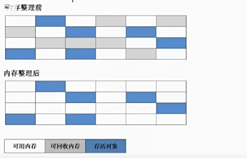

### 2. 复制算法（年轻代）
    为了解决效率问题，“复制”收集算法出现了，它可以内存分为大小相同的两块，每次使用其中的一块，当这一块的内存使用完后，就将还存活的对象复制到另一块去，然后再把使用的空间一次清除掉，就这样每次的内存回收都是对内存区间一半进行回收。
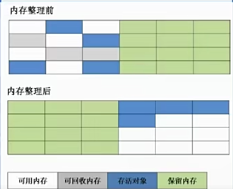

### 3. 标记-整理算法（老年代）
    根据老年代的特点特出的一种标记算法，标记过程仍然与“标记-清除”算法一样，但是后续步骤不是直接对可回收对象回收，而是让所有的存活对象向一端移动，然后直接清理掉端边界以外的内存。
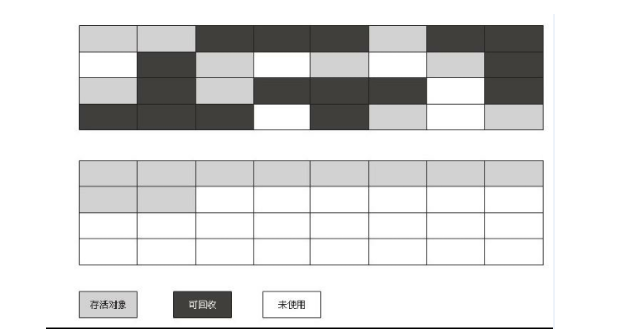

### 4. 分代收集算法
    把Java堆分为新生代和老年代，这样就可以根据各个年代的特点采用最适当的收集算法。


如果说垃圾收集算法是内存回收的方法论，那么垃圾收集器就是内存回收的具体实现。
根据应用场景选择适合自己的垃圾回收器。

## 垃圾回收器

实际上，垃圾收集器（GC，Garbage Collector）是和具体 JVM 实现紧密相关的，不同厂商（IBM、Oracle），不同版本的 JVM，提供的选择也不同。接下来，我来谈谈最主流的 Oracle JDK。
### 1、 Serial GC，
   它是最古老的垃圾收集器，“Serial”体现在其收集工作是单线程的，并且在进行垃圾收集过程中，会进入臭名昭著的“Stop-The-World”状态。当然，其单线程设计也意味着精简的 GC 实现，无需维护复杂的数据结构，初始化也简单，所以一直是 Client 模式下 JVM 的默认选项。
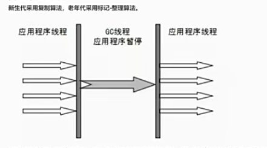

新生代使用的复制算法，老年代使用：标记整理算法；
从年代的角度，通常将其老年代实现单独称作 Serial Old，它采用了标记 - 整理（Mark-Compact）算法，区别于新生代的复制算法。
Serial GC 的对应 JVM 参数是：
```java
年轻代使用：-XX:+UseSerialGC
老年代轻代使用：-XX:+UseSerialOldGC
```

### 2、 ParNew GC
    很明显是个新生代 GC 实现，它实际是 Serial GC 的多线程版本，最常见的应用场景是配合老年代的 CMS GC 工作，下面是对应参数
```java
-XX:+UseConcMarkSweepGC -XX:+UseParNewGC
```
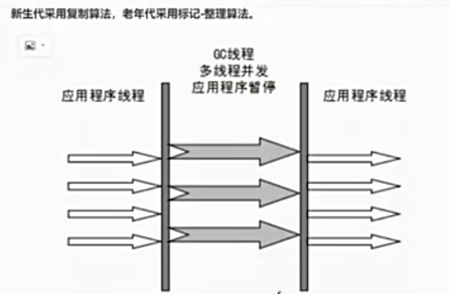
### 3、 CMS（Concurrent Mark Sweep） GC
    基于标记 - 清除（Mark-Sweep）算法，设计目标是尽量减少停顿时间，这一点对于 Web 等反应时间敏感的应用非常重要，一直到今天，仍然有很多系统使用 CMS GC。但是，CMS 采用的标记 - 清除算法，存在着内存碎片化问题，所以难以避免在长时间运行等情况下发生 full GC，导致恶劣的停顿。另外，既然强调了并发（Concurrent），CMS 会占用更多 CPU 资源，并和用户线程争抢。
### 4 、Parrallel GC
    在早期 JDK 8 等版本中，它是 server 模式 JVM 的默认 GC 选择，也被称作是吞吐量优先的 GC。它的算法和 Serial GC 比较相似，尽管实现要复杂的多，其特点是新生代和老年代 GC 都是并行进行的，在常见的服务器环境中更加高效。开启选项是：
```java
-XX:+UseParallelGC
-XX:+UseParallelOldGC
```

另外，Parallel GC 引入了开发者友好的配置项，我们可以直接设置暂停时间或吞吐量等目标，JVM 会自动进行适应性调整，例如下面参数：
```
-XX:MaxGCPauseMillis=value-XX:GCTimeRatio=N // GC 时间和用户时间比例 = 1 / (N+1)

```
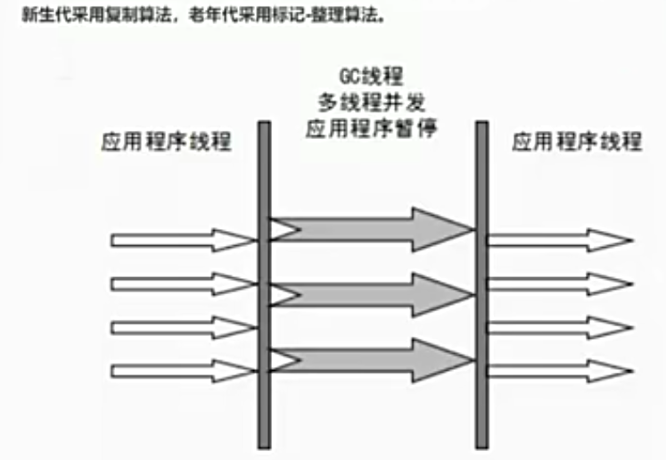

* G1 GC 这是一种兼顾吞吐量和停顿时间的 GC 实现，是 Oracle JDK 9 以后的默认 GC 选项。G1 可以直观的设定停顿时间的目标，相比于 CMS GC，G1 未必能做到 CMS 在最好情况下的延时停顿，但是最差情况要好很多。
* G1 GC 仍然存在着年代的概念，但是其内存结构并不是简单的条带式划分，而是类似棋盘的一个个 region。Region 之间是复制算法，但整体上实际可看作是标记 - 整理（Mark-Compact）算法，可以有效地避免内存碎片，尤其是当 Java 堆非常大的时候，G1 的优势更加明显。
* G1 吞吐量和停顿表现都非常不错，并且仍然在不断地完善，与此同时 CMS 已经在 JDK 9 中被标记为废弃（deprecated），所以 G1 GC 值得你深入掌握。

---
**重点**
- CMS垃圾收集器（-XX:+UseConcMarkSweepGC(old)）  只能用于老年代
- CMS（ConCurrent Mark Sweep）收集器是一种以获取最短回收停顿时间为目标的收集器，他非常符合在注重用户体验的应用上，它是HotSpot虚拟机第一款真正意义上的高并发收集器，他第一次实现了让垃圾收集线程与用户线程（基本上）同时工作。
- 从名字中Mark Sweep这两个词可以看出，CMS收集器是一种“标记-清除”算法实现，它的运作过程相比之前的几种垃圾回收器来说更加复杂一些，整个过程分为四个步骤：
- 初始标记：暂停所有的其他线程，并记录下gc roots直接能引用的对象，速度很快；
- 并发标记：同时开启GC和用户线程，用一个闭包的结构去记录可达对象，但在这个阶段结束，这个闭包结构并不能保证包含当前所有的可达对象，因为用户线程可能会不断的更新引用域，所以GC线程无法保证可达性分析的实时性，所以这个算法里会跟踪记录这些发生引用更新的地方。
- 重新标记：重新标记阶段就是为了修正并发标记期间因为用户线程继续运行而大致标记产生变动的那一部分对象的标记记录，这个阶段的停顿时间一般会比初始标记时间稍长，云云比并发标记阶段时间短
- 并发清理：开启用户线程，同时GC线程开始对未标记的区域做清扫；
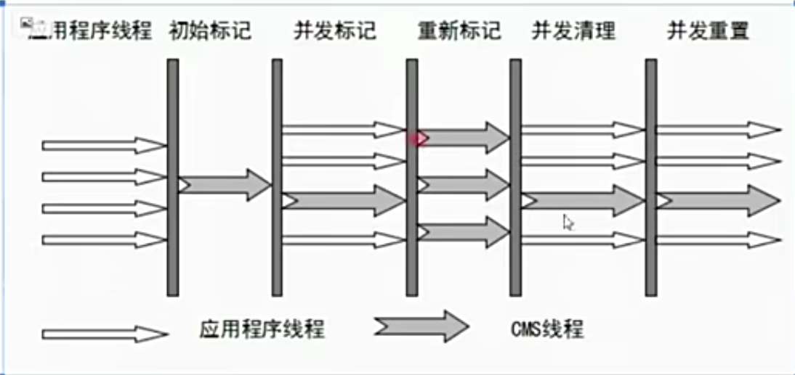

G1从它的名字就可以看出他是一款优秀的垃圾回收器，主要优点：并发收集、低停顿，但是它有以下几个明显的缺点：
* 对CPU资源敏感（会和服务抢资源）
* 无法处理浮动垃圾（在并发清理阶段又产生垃圾，这种浮动垃圾只能等到下一次GC在清理）
* 它使用的回收算法“标记-清除”算法会导致收集结束时候会有大量的空间碎片，当然通过参数 -XX:+UseCMSCompactAtFullCollection 可以让JVM在执行完标记清除后在做整理
* 执行过程中不确定性，会存在上一次垃圾回收还没执行完成，然后垃圾回收又被触发的情况，特别是在并发标记和并发清理阶段会出现，一边回收，系统一遍运行，也许没有回收完成就再次触发FUll GC，也就是“Concurrent model failure”，此时会进入stop the world，用serial old垃圾收集器来回收

CMS的相关参数
```
-XX:+UseConcMarkSweepGC      启用cms
-XX:ConcGCThreads         并发的GC的线程数
-XX:+UseCMSCompactAtFullCollection       FullGC之后做压缩整理（减少碎片）
-XX:+CMSFullGCsBeforeCompaction           多少次FullGC之后压缩一次，默认0，代表每次FullGC后都会压缩一次
-XX:CMSInitiatingOccupancyFraction           当老年代使用达到该比例时候会出发Full GC（默认是92，这是百分比）
-XX:+UseCMSInitiatingOccupancyOnly        只使用设定的回收阈值（-XX:CMSInitiatingOccupancyFraction 设定的值），如果不指定，JVM仅在第一次使用设定值，后续则会自动调整；
-XX:+CMSScavengeBeforeRemark                在CMS GC前启动一次Minor GC，目的在于减少老年代对年轻代的引用，降低CMS GC的标记阶段的开销，一般CMS的GC耗时80%都在标记阶段
```


> 案例：
* 亿级流量电商系统如何优化JVM参数设置（ParNew+CMS）
* 大型电商系统后端现在一般都拆分成多个子系统部署的，比如：商品系统，库存系统，订单系统，促销系统，会员系统等等，以订单为例
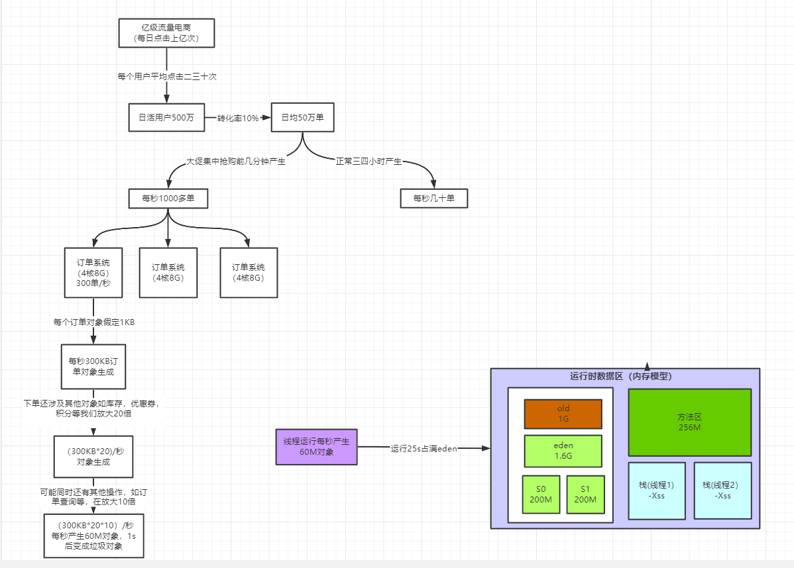

对于8G内存，我们一般是分配4G到5G内存给JVM，（那么堆内存大概在3G左右）正常的JVM参数配置如下：

设置1：
```
-Xms:3072M -Xmx:3072M -Xmn:1536M -Xss:1M -XX:PermSize:256M -XX:MaxPermSIze:256M  -XX:SurvivorRatio:8
说明：
Xmx:3072M                       设置JVm最大可用内存为3G；
Xms:3072M                       设置JVM动态可使用内存为3G，建议线上和Xmx配置成一样，避免每次垃圾回收完成后JVM重新分配内存；
Xmn:1536M                       设置JVM堆内新生代的大小，通过这个值也可得到老年代的大小，-Xmx 减去 -Xmn
Xss:1M                               设置每个线程可使用的内存大小，即栈的大小，在相同物理内存下，减小这个值能生成更多的线程，
-XX:PermSize                     设置非堆去初始内存分配大小
-XX:MaxPerm                     设置非堆区分配内存的最大上限（非堆内存区[方法区]是不会被Java垃圾回收机制进行处理的地方）
-XX:SurvivorRatio:8            设置新生代中的eden区和s1与s2的比例是：8:1:1
```

1 如果按照如上配置，则内存数据是：

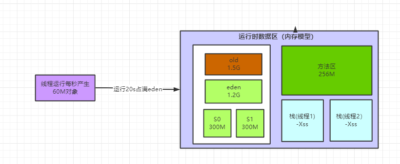

系统按照每秒生成60M的速度来生成对象，大概运行了20s就会撑满eden区，会出发minor Gc，大概会有95%以上的对象成为垃圾被回收，可能最后一两秒生成的对象还保留引用，我们暂时估计为100M左右，那么这100M会被挪到s0区，根据动态对象年龄判断原则，这100M对象同龄而且总和大于S0区的50%，那么这些对象都会直接被挪到老年代，到了老年代不到一秒又变成了垃圾对象，很明显，survivor区域大小设置有点小，我们分析系统也只就知道，明显大部门对象都是短周期生存的，根本不应该频繁进入老年代，也没有必要给老年代位置过大的内存空间，得让对象留在新生代里；

于是，我们可以更新下JVM的参数设置：

设置2：
```
-Xms:3072M -Xmx:3072M -Xmn:2048M -Xss:1M -XX:MeatspaceSize:256M -XX:MaxMeatspaceSize:256M  -XX:SurvivorRatio:8
```
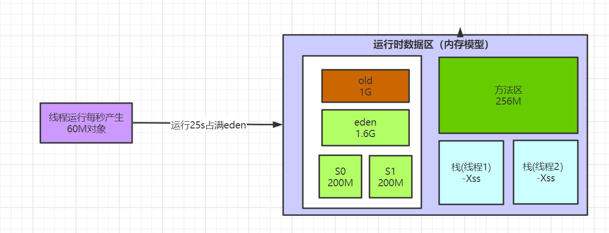

这样就降低了因为队形动态年龄判断原则导致的队形频繁进去老年代的问题，其实很多优化无非就是让短期存活的对象尽量都留在Survivor区，不要进入老年代，这样在mirror GC的时候这些对象都会被回收，不会进入老年代而导致full gc；
对于对象年龄应该为多少才移动到老年代比较合适，本例中一次mirror gc要间隔二三十秒。大对数对象一般都在几秒内就变为垃圾，完全可以将默认的15岁改小一些，比如改为5，那么以为这对象要经过5次mirror gc就会进入老年代，这个时间也只有一两分钟，如果对象这么长时间没有被回收，完全可以认为这些对象会是存活时间比较长的对象，可以移到老年代，而不是继续一直占用这survivor区空间。
对于多大对象直接进入老年代（参数 -XX:PretenureSizeThreshold），这个一般可以结合自己的系统看些有没有什么大对象生成，预计下大对象的大小，一般来说设置1M就差不多了，很少有超过1M的大对象，这些对象一般就是你系统初始化分配的缓存队形，比如大的缓存list，Map之类的。

可以适当调整JVM参数如下：
```
-Xms:3072M -Xmx:3072M -Xmn:2048M -Xss:1M -XX:PermSize:256M -XX:MaxPermSIze:256M  -XX:SurvivorRatio:8
-XX:MaxTenuringThreshold=5  -XX:PretenureSizeThreshold=1M -xx:+UseParNewGC -XX:+UseConcMarkSwepGC
-XX:CMSInitiatingOccupancyFraction=92  -XX:UseCMSCoimpactAtFullCollection -XX:CMSFullGCsBeforeCompaction = 0
```
当前这个系统哪些对象可能长期存活躲过5次mirror gc最终进入老年代，无非是那些spring容器里面的Bean，线程池对象，一些初始化缓存数据对象等，这些加起来充其量也就几十MB，还有就是某次mirror gc完了之后还有超过200M的存活对象，那么就会直接进入老年代，比如突然某一秒瞬间要处理五六百单，那么每秒生成的对象可能有一百多M，再加上整个系统可能压力剧增，一个订单要好几秒才能处理完，下一秒可能又有很多订单过来。我们可以估算下大概每隔五六分钟出现一次这样的情况，那么大概半个小时到一个小时之间就可能因为老年代满了而出发一次Full GC，Full GC的触发条件还有我们之前说的老年代空间分配担保机制，历次的mirror gc挪动到老年代的对象肯定是非常小的，所以几乎不会再mirror gc出发之前由于老年代空间分配担保失败而产生full gc，其实在半个小时候后发生的full gc，这个时候已经过了抢购的高峰期，后续可能几小时才能做一次Full GC。
对于碎片整理，因为都是1小时或几小时才做一次Full GC，是可以每次做完就开始碎片整理。


**JVM调优：希望可以长期存活的对象，尽早的进入老年代；减少Full GC的次数和Full GC的时间；**
