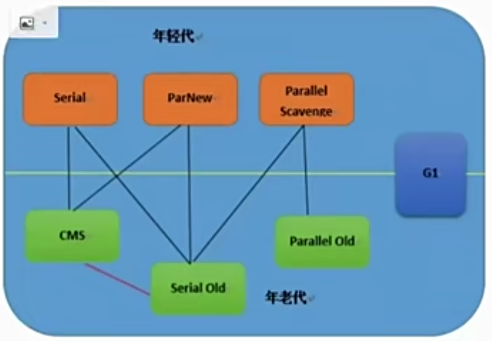

G1垃圾回收器
G1天生就适合在这种大内存的机器上运行，可以比较完美的解决大内存垃圾回收时间过长的问题，

如何选择垃圾收集器：
1、优先调整堆内存的大小让服务器自己来选择
2、 如果内存小于100M，使用串型收集器
3、 如果是单核，并且没有停顿时间要求，串行或者JVM自己选择
4、 如果允许停顿时间超过1s，选择并行或者jvm自己选择
5、 如果响应时间最重要，并且不能超过一秒，使用并发收集器，ParNew  与CMS的组合或G1，因为性能高
下图连线可以搭配使用：

