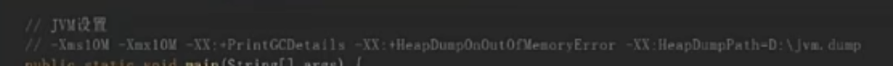
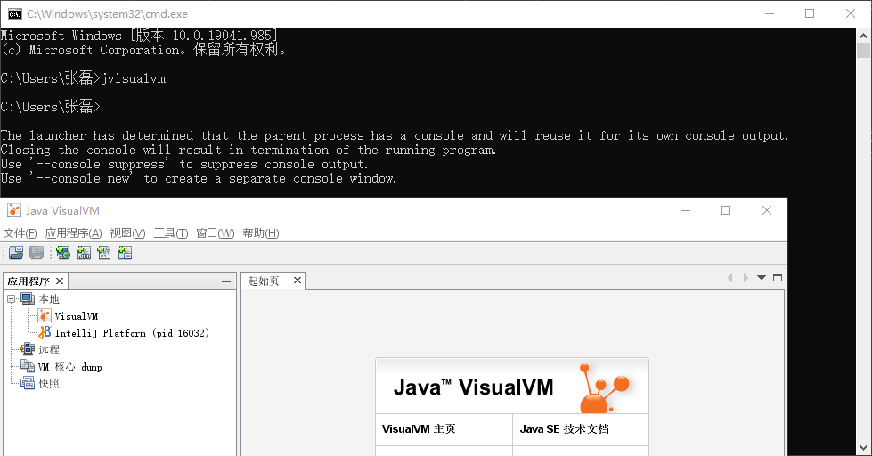
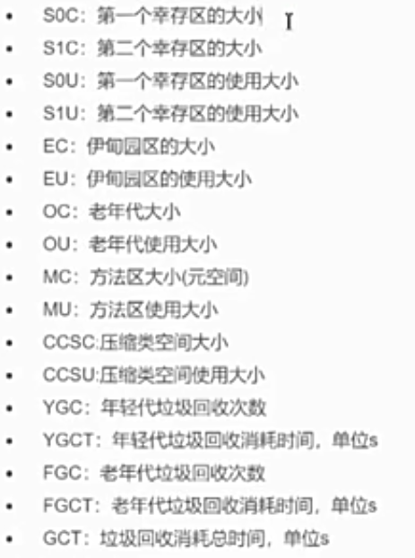
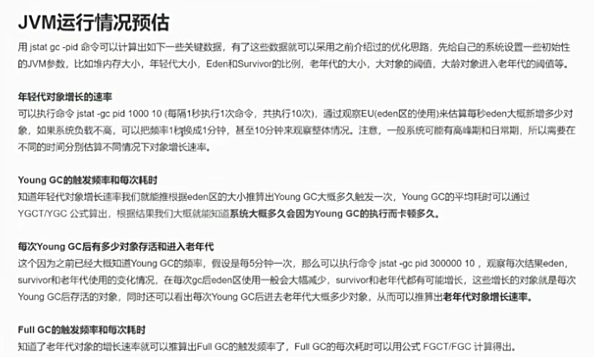

# JVM调优工具详解

## Jmap
此命令可以用来查看内存信息
eg：实例个数已经占用内存大小
```
jmap -histo  进程号
```
堆内存dump
```
jmap -dump:format=b.file=a.hprof 进程号
```

jvm配置：（当发生内存溢出后，自动导出那一刻dump文件）
-XX:+HeapDumpOnOutOfMemoryError
-XX:HeapDumpPath=/路径


生成文件后，可以使用jvisualvm命令工具分析：



## Jstat
核心命令：Jstst
Jstat命令可以查看堆内存各部分的使用量，以及加载类的数量，命令格式如下：
```java
jstat [-命令选项][vmid][间隔时间（毫秒）[查询次数]

```
注意：使用的jdk版本是1.8

垃圾回收统计：
jstat -gc pld 最常用，可以评估程序内存使用及GC统计


通过jstat -gc pld 1000 5    （解释：每间隔1000毫秒执行一次，只查询五次，可以查询出一些指标）

