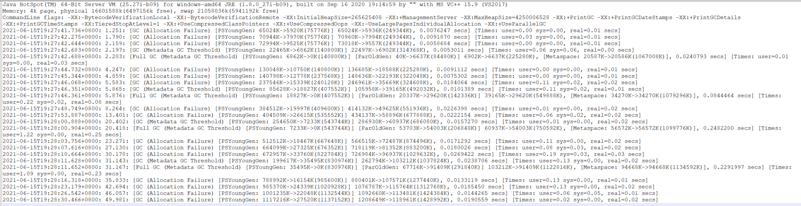
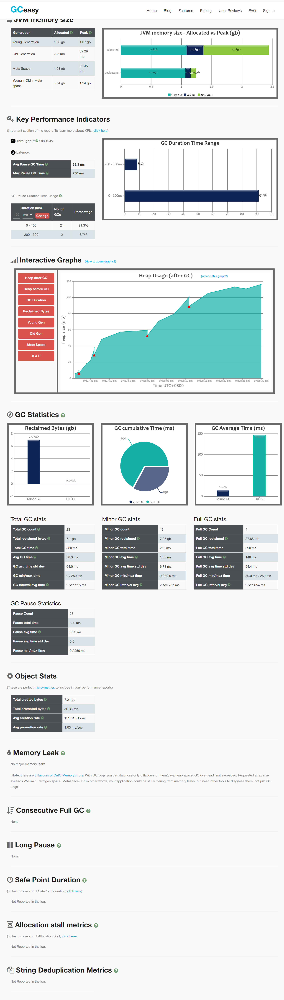
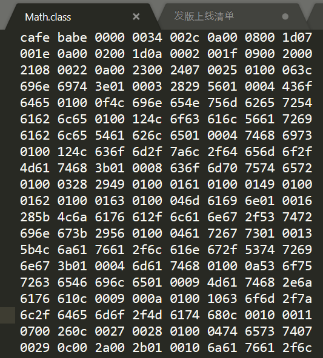
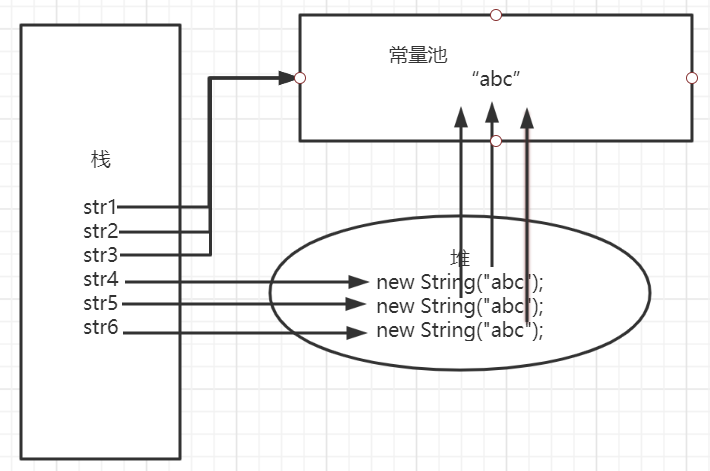

# JVm调优实战及常量池详解

分析GC日志
GC日志分析工具，gceasy
```java
打印GC日志的方法，在JVM参数中添加参数
-XX:+PrintGCDetails -XX:+PrintGCTimeStamps -XX:+PrintGCDateStamps -Xloggc:./gc.log
```
打印GC日志如下：


* 第一行：是Java项目的环境信息
* 第三行：打印的项目启动参数，这里不仅打印了GC日志，还有相关的VM内存参数
* 从第五行开始，打印的是GC时间点发生的GC之后相关的GC情况。
* 对于1.251 这里是具体发生GC的时间点，这里时间戳是从jvm启动开始计算的，前面还有具体发生的时间日期；
* Full GC（Metadata GC Threshold） 指这是一次Full GC，括号里是gc的原因，PSYoungGen是年轻代GC，ParOldGen是老年代GC，Metaspace是元空间的GC
* 65024 ->5920K(75776K),这三个数字分别对应gc之前占用的年轻代（老年代）大小，GC之后年轻代（老年代）占用，以及整个年轻代（老年代）的大小
* 0.0076247 是时间点GC总耗费时间

https://gceasy.io/

使用gceasy分析

Class常量池
class常量池可以理解为是class文件中的资源仓库，Class文件中除了包含类的版本、字段、方法、接口等描述信息外，还有一项信息就是常量池（constant pool table），用于存放编译器生成的各种字面量（Litera）和符号引用（Symbolic References）
一个class文件的16进制大体结构如下图所示：

对应的含义如下，细节可以查看Oracle的官方文档
```
cafe babe    0000        0034                               0042                    0a00
魔数         次版本        主版本（十进制52，JDK1.8）         常量池计数器              常量池数据区
```
当然我们一般不会去人工解析这种16进制的字节码文件，我们一般可以通过Javap命令生成可读的JVm字节码指令文件：
javap -v Math.class > Math.txt
```
Classfile /D:/sourcecode/Demo/out/production/Demo/com/zl/demo/Math.class
  Last modified 2021-5-13; size 729 bytes
  MD5 checksum 1b66d6213a1a081670d8daf53a3b1b2c
  Compiled from "Math.java"
public class com.zl.demo.Math
  minor version: 0
  major version: 52
  flags: ACC_PUBLIC, ACC_SUPER
Constant pool:
   #1 = Methodref          #8.#29         // java/lang/Object."<init>":()V
   #2 = Class              #30            // com/zl/demo/Math
   #3 = Methodref          #2.#29         // com/zl/demo/Math."<init>":()V
   #4 = Methodref          #2.#31         // com/zl/demo/Math.computer:()I
   #5 = Fieldref           #32.#33        // java/lang/System.out:Ljava/io/PrintStream;
   #6 = String             #34            // test
   #7 = Methodref          #35.#36        // java/io/PrintStream.println:(Ljava/lang/String;)V
   #8 = Class              #37            // java/lang/Object
   #9 = Utf8               <init>
  #10 = Utf8               ()V
  #11 = Utf8               Code
  #12 = Utf8               LineNumberTable
  #13 = Utf8               LocalVariableTable
  #14 = Utf8               this
  #15 = Utf8               Lcom/zl/demo/Math;
  #16 = Utf8               computer
  #17 = Utf8               ()I
  #18 = Utf8               a
  #19 = Utf8               I
  #20 = Utf8               b
  #21 = Utf8               c
  #22 = Utf8               main
  #23 = Utf8               ([Ljava/lang/String;)V
  #24 = Utf8               args
  #25 = Utf8               [Ljava/lang/String;
  #26 = Utf8               math
  #27 = Utf8               SourceFile
  #28 = Utf8               Math.java
  #29 = NameAndType        #9:#10         // "<init>":()V
  #30 = Utf8               com/zl/demo/Math
  #31 = NameAndType        #16:#17        // computer:()I
  #32 = Class              #38            // java/lang/System
  #33 = NameAndType        #39:#40        // out:Ljava/io/PrintStream;
  #34 = Utf8               test
  #35 = Class              #41            // java/io/PrintStream
  #36 = NameAndType        #42:#43        // println:(Ljava/lang/String;)V
  #37 = Utf8               java/lang/Object
  #38 = Utf8               java/lang/System
  #39 = Utf8               out
  #40 = Utf8               Ljava/io/PrintStream;
  #41 = Utf8               java/io/PrintStream
  #42 = Utf8               println
  #43 = Utf8               (Ljava/lang/String;)V
{
  public com.zl.demo.Math();
    descriptor: ()V
    flags: ACC_PUBLIC
    Code:
      stack=1, locals=1, args_size=1
         0: aload_0
         1: invokespecial #1                  // Method java/lang/Object."<init>":()V
         4: return
      LineNumberTable:
        line 10: 0
      LocalVariableTable:
        Start  Length  Slot  Name   Signature
            0       5     0  this   Lcom/zl/demo/Math;


  public int computer();
    descriptor: ()I
    flags: ACC_PUBLIC
    Code:
      stack=2, locals=4, args_size=1
         0: iconst_1
         1: istore_1
         2: iconst_2
         3: istore_2
         4: iload_1
         5: iload_2
         6: iadd
         7: bipush        10
         9: imul
        10: istore_3
        11: iload_3
        12: ireturn
      LineNumberTable:
        line 12: 0
        line 13: 2
        line 14: 4
        line 15: 11
      LocalVariableTable:
        Start  Length  Slot  Name   Signature
            0      13     0  this   Lcom/zl/demo/Math;
            2      11     1     a   I
            4       9     2     b   I
           11       2     3     c   I


  public static void main(java.lang.String[]);
    descriptor: ([Ljava/lang/String;)V
    flags: ACC_PUBLIC, ACC_STATIC
    Code:
      stack=2, locals=2, args_size=1
         0: new           #2                  // class com/zl/demo/Math
         3: dup
         4: invokespecial #3                  // Method "<init>":()V
         7: astore_1
         8: aload_1
         9: invokevirtual #4                  // Method computer:()I
        12: pop
        13: getstatic     #5                  // Field java/lang/System.out:Ljava/io/PrintStream;
        16: ldc           #6                  // String test
        18: invokevirtual #7                  // Method java/io/PrintStream.println:(Ljava/lang/String;)V
        21: return
      LineNumberTable:
        line 19: 0
        line 20: 8
        line 21: 13
        line 22: 21
      LocalVariableTable:
        Start  Length  Slot  Name   Signature
            0      22     0  args   [Ljava/lang/String;
            8      14     1  math   Lcom/zl/demo/Math;
}
SourceFile: "Math.java"
```
上面红框标出的就是class的常量池信息，常量池中主要存放两大类常量：字面量和符号引用

字面量：字面量就是指由字母、数字等构成的字符串或者数值常量；
字面量只可以右值出现，所谓右值是指等号左边的值，如int a=1，这里a为左边的值，1为右边的值，这个例子中1就是字面量；

符号引用
符号引用就是编译原理中的概念，是相对于直接引用来说的，主要包括了一下三类常量：
类和接口的全限定名
字段的名称和描述符
方法的名称和描述符

上面的常量池是静态的常量池，只有到运行是被加载到内存后，这些符号才有对应的内存地址（方法区），这些常量池一旦被装入内存就变成了运行时常量池了，对应的符号引用在程序加载或者运行时会被转变为被加载到内存区域的代码的直接引用，也就是我们说的动态链接了。例如：computer()这个符号引用在运行是就会被转变成computer()方法具体代码中内存地址，主要通过对象头里类型指针去转换直接引用。

JDK1.8之后，无永久代，常量池在元空间

字符串常量池
* 字符串常量池的设计思想
* 字符串的分配，和其他队形分配一样，耗费高昂的时间与空间代价，作为最基础的数据类型，大量频繁的创建字符串，极大程度的影响程序的性能；
* JVM为了提高性能和减少内存的开销，在实例化字符串的时候进行了一些优化
* 为字符串开辟了一个字符串的常量池，类似于缓存区
* 创建字符串常量时，首先坚持字符串常量池是否存在字符串
* 存在该字符串，返回引用实例，不存在，实例化该字符串并放入池中

代码实例，一些字符串局部变量操作
```
String str1 = "abc";
String str2 = "abc";
String str3 = "abc";
String str4 = new String("abc");
String str5 = new String("abc");
String str6 = new String("abc");
```

面试题：String str4 = new String("abc")创建了多少个对象？
在常量池中直接查找是否有“abc”的对象
有返回对应引用实例
没有则在常量池中创建对应的实例对象
2.    在堆中new一个String("abc")对象
3.    将对象地址赋给str4，创建一个引用
所以，常量池中没有“abc”字面量则创建两个对象，否则创建一个对应，以及创建一个引用
      String.intern()
      通过new操作符创建的字符串对象不指向字符串常量池中的任何对象，但是可以通过使用字符串的intern()方法来指向其中的某一个，java.lang.String.intern()返回一个常量池里面的字符串，就是一个在字符串常量池中有了一个入口，如果以前没有在字符串常量池中，那么他就会被添加到里面；
